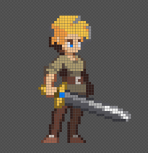

# Pixel Jump

Pixel Jump es un juego de plataformas 2D desarrollado en **Unity**, diseñado para dispositivos **Android**. El objetivo del juego es ascender saltando entre plataformas, evitando enemigos y superando desafíos a medida que la velocidad de la pantalla aumenta.

## Características

📱 **Desarrollado en Unity** y optimizado para **Android.**

🎨 **Sprites creados con Pisxel,** incluyendo el personaje principal.

🏆 **Sistema de puntuación basado en la altura alcanzada.**

⚡ **Aumento progresivo de la velocidad** a medida que se sube.

🎮 **Menús y pantalla de Game Over creados con botones en Android.**

🦠 **Enemigos que aparecerán a lo largo del ascenso.**

## Mecánicas de Juego

🎯 **El jugador debe saltar entre plataformas** para ascender lo más alto posible.

🔥 **Enemigos aparecerán en el camino,** dificultando el progreso.

⏫ **La pantalla sube lentamente** y aumenta de velocidad con la altura.

📏 **Un contador de altura** mostrará los metros alcanzados en tiempo real.

🏁 **Al final de la partida, en la pantalla Game Over,** se mostrará la altura máxima alcanzada.

## Capturas de pantalla

## Instalación y Ejecución

Clona el repositorio:

git clone https://github.com/JuanCarlos92/Juego2D_Plataforma.git

Abre el proyecto en **Unity.**

Compila y ejecuta en un dispositivo **Android** o en un emulador.

## Estado del Proyecto

📌 Actualmente en desarrollo. Próximamente se agregarán más funcionalidades y mejoras.

## Créditos

🎨 **Sprites creados con Pisxel**
🚀 **Desarrollado en Unity**
📱 **Optimizado para Android**

